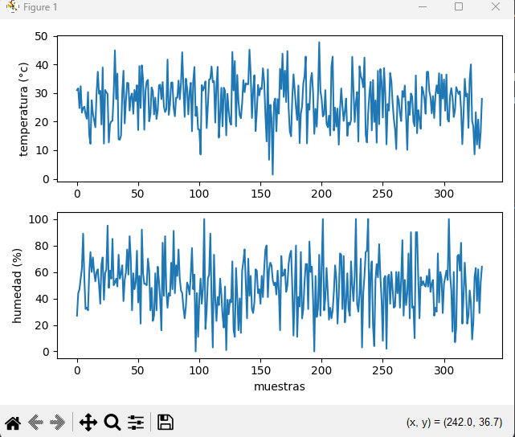
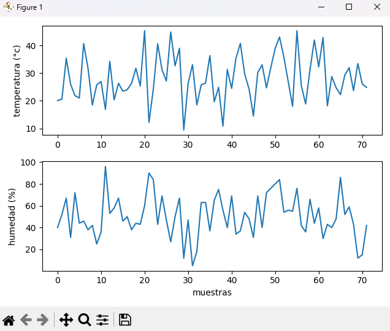
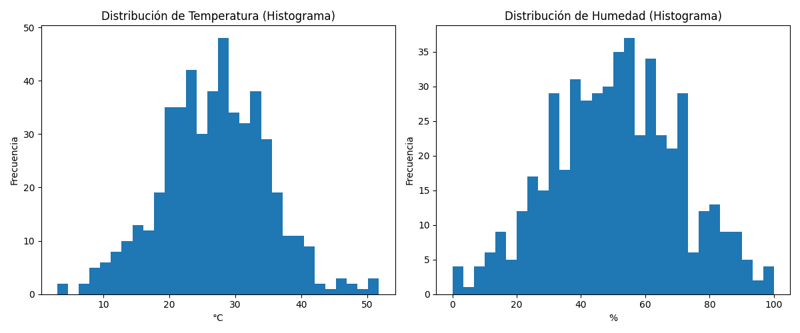

# 📝 IoT: Estación Meteorológica

## 📌 Descripción General

Se simula una estación meteorológica IoT que envía telemetría a un **Kafka Broker**.

El proyecto incluye dos pipelines:

1. **Modo JSON:** telemetría normal usando mensajes descriptivos.
2. **Modo ENCODED:** telemetría optimizada en solo **3 bytes** (24 bits), simulando redes IoT restringidas como LoRa o Sigfox.

Se incluyen Producers, Consumers, simulación de sensores y gráficas en tiempo real.

## 📁 Estructura del Proyecto

```bash
.
├── consumer_encoded.py
├── consumer_json.py
├── distribution.py
├── docs/
├── encoding.py
├── images/
├── producer_encoded.py
├── producer_json.py
├── requirements.txt
└── sensors.py
```

### `sensors.py`

Genera las mediciones con distribución normal.

### `producer_json.py`

Envía telemetría en JSON al broker.

### `consumer_json.py`

Recibe JSON y grafica en tiempo real.

### `encoding.py`

Codifica/decodifica los datos en **3 bytes**.

### `producer_encoded.py`

Envía telemetría codificada.

### `consumer_encoded.py`

Recibe, decodifica y grafica.

### `distribution.py`

Genera histogramas para evidencias.

## 📦 Instalación

1. Crear entorno virtual

    ```bash
    python -m venv venv
    source venv/bin/activate     # Linux/macOS
    venv\Scripts\activate        # Windows
    ```

2. Instalar dependencias

    ```bash
    pip install -r requirements.txt
    ```

## 🚀 Ejecución

### 1️⃣ **Simulación de Sensores**

Los sensores se generan en `sensors.py` y producen:

- Temperatura (float, distribución normal)
- Humedad (entero, distribución normal)
- Dirección del viento (categoría entre 8 valores)

### **A. Modo JSON (pipeline normal)**

#### Abrir dos terminales

##### **Consumer JSON**

```bash
python consumer_json.py <carnet> <group_id>
```

Ejemplo:

```bash
python consumer_json.py 22801 grupo1
```

##### **Producer JSON**

```bash
python producer_json.py <carnet>
```

Ejemplo:

```bash
python producer_json.py 22801
```

## **B. Modo ENCODED (pipeline con restricción de 3 bytes)**

### Consumer ENCODED

```bash
python consumer_encoded.py <carnet> <group_id>
```

### Producer ENCODED

```bash
python producer_encoded.py <carnet>
```

El producer codifica la telemetría en **24 bits** usando `encoding.py`:

- 14 bits → temperatura escalada
- 7 bits → humedad
- 3 bits → dirección del viento

El consumer decodifica los 3 bytes, reconstruye la medición y actualiza gráficas en vivo.

## **C. Evidencia de Distribución Normal**

Para demostrar que los sensores usan distribución Gaussiana:

```bash
python distribution.py
```

Esto genera histogramas de temperatura y humedad.

## 🖼️ Evidencias

### Productor/Consumidor JSON



### Ejemplo: Telemetría codificada en 3 bytes



### Distribución normal simulada


